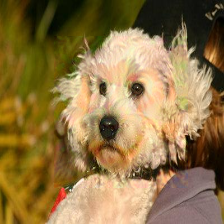
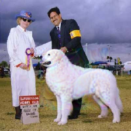

# Baidu_Adversarial_Attack
No.3 Solution of DIDIDI in [Baidu Adversarial Attack Competition](https://aistudio.baidu.com/aistudio/competition/detail/15), team member [Mercurial](https://github.com/Mercurialzhang) and 呐小漠

## Our Method

We uses MI-FGSM as our baseline to attack models.

Some of our tricks:

1. Ensemble 6 models
2. Use linf to normalize noise instead of sign
3. Input Diversity
4. Informative region mask

## Results






## Dependencies
[PaddlePaddle](https://www.paddlepaddle.org.cn/) == 1.6.2

## Run the code
1. Download model parameters and mask annotation from [Google Drive](https://drive.google.com/open?id=1JmcQFl1cIIh7Fnh9PSiM1zAefYGoujsv)
2. unzip files
```bash
unzip models_parameters.zip
unzip annotation.zip
```
3. run attack code, adversarial examples are in 'result' folder
```bash
mkdir result
python run_attack.py
```

## References
[1] Madry, Aleksander, et al. "Towards deep learning models resistant to adversarial attacks." arXiv preprint arXiv:1706.06083 (2017).

[2] Dong, Yinpeng, et al. "Boosting adversarial attacks with momentum." Proceedings of the IEEE conference on computer vision and pattern recognition. 2018.

[3] Xie, Cihang, et al. "Improving transferability of adversarial examples with input diversity." Proceedings of the IEEE Conference on Computer Vision and Pattern Recognition. 2019.